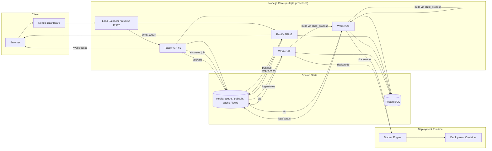
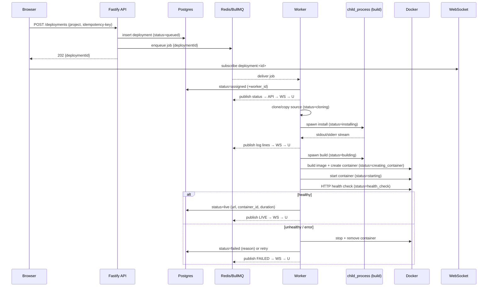
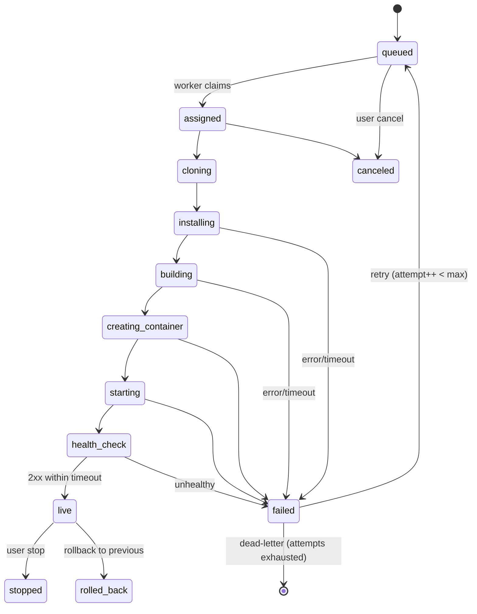
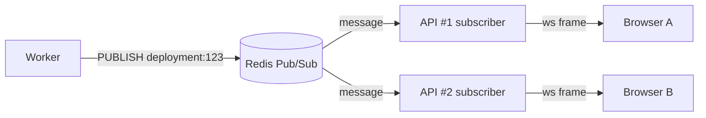
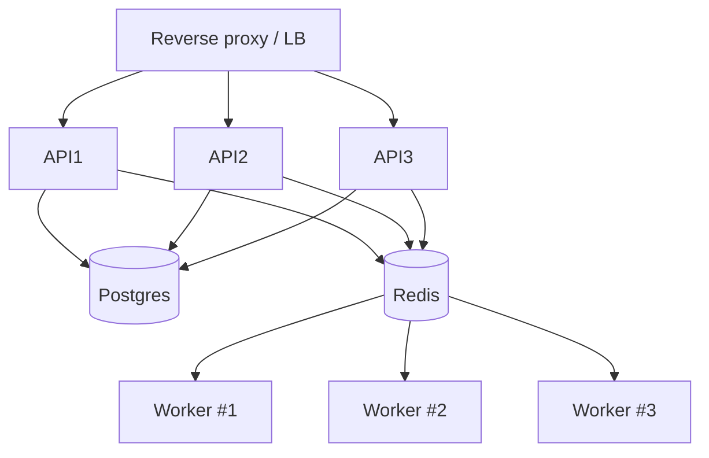

# ForgeCloud — Architecture

This document describes how ForgeCloud is put together: the components, how data flows, the deployment pipeline as a state machine, how it scales on a single laptop, and the key technical decisions (with rationale).

---

## 1. High-level view



**Golden rule:** authoritative state lives in **Postgres** (durable) and **Redis** (ephemeral/coordination), never in a single process's memory. That's what lets multiple API and worker processes cooperate and what makes the local-scaling demo honest.

---

## 2. Components

### 2.1 Dashboard — `apps/dashboard` (Next.js)
Visual-first control plane. Shows, live:
- Deployment pipeline animation (Created → Queued → Worker Assigned → Cloning → Installing → Building → Creating Container → Starting → Health Check → LIVE).
- Live log stream, deployment status, build history, failures/retries.
- Worker status, running containers, queue size, deployment duration.
- CPU/memory usage, event-loop lag, application health.
- Env vars, RBAC/members, system activity/audit, and an architecture/activity view.

Talks to the API over REST (mutations/reads via TanStack Query) and over **WebSocket** for live logs/status/metrics.

### 2.2 API — `apps/api` (Fastify)
The control plane brain. Responsibilities:
- Auth (sessions/tokens, API keys), organizations, RBAC.
- CRUD for projects, env vars, domains.
- Creating deployments and **enqueuing** deployment jobs (it never builds anything itself).
- WebSocket gateway: browser subscribes to `deployment:<id>`, `project:<id>`, `org:<id>`, `metrics`; the API bridges Redis Pub/Sub → socket.
- Serving metrics (`/metrics`) and system/observability endpoints.

Structured as Fastify plugins: `auth`, `projects`, `deployments`, `ws`, `metrics`, `admin`. Cross-cutting plugins: error handler, rate limiter, request context/logging.

### 2.3 Worker — `apps/worker`
Consumes BullMQ jobs and executes the deployment pipeline (§4). One worker = one Node process; run several to demo concurrency. Each worker:
- Registers/heartbeats itself in the `workers` table.
- Pulls a job, claims it (updates `deployments.worker_id`, status `assigned`).
- Runs the pipeline, streaming logs and status to Redis at every step.
- Handles timeouts, failures, retries, and cleanup.

### 2.4 Shared packages
- `packages/db` — Kysely client, generated types, `node-pg-migrate` migrations, repository helpers.
- `packages/queue` — BullMQ queue names, job payload types, connection factory (shared by API producer + worker consumer).
- `packages/shared` — Zod schemas, domain types, **WebSocket event contracts**, deployment status enum, constants.
- `packages/config` — Zod-validated env parsing, `pino` logger factory.

### 2.5 Data stores
- **PostgreSQL** — users, orgs, projects, deployments, deployment_events, workers, api_keys, domains, files/artifacts, usage, audit_logs. Source of truth. (See `DATA_MODEL.md`.)
- **Redis** — BullMQ queue, Pub/Sub (log/status fan-out), cache, rate-limit counters, distributed locks (e.g. one live container per project), worker heartbeats/ephemeral state.

### 2.6 Local object storage — `packages/storage` abstraction
A local-filesystem "object store" (`storage/<org>/<project>/<deployment>/…`) behind an interface (`put/get/list/delete`) so it *looks* like S3. Holds source snapshots, build artifacts (gzip via `node:zlib` in a worker thread), and persisted log files. Uploads/downloads are streamed with backpressure.

---

## 3. Request/data flow — a deploy, end to end



---

## 4. Deployment pipeline — state machine



- Every transition → **persist to `deployments.status` + append `deployment_events`** and **publish to `deployment:<id>`**.
- **Retry:** BullMQ attempts with exponential backoff; each attempt increments `deployments.attempt`. On exhaustion → dead-letter + `failed`.
- **Rollback:** re-point the project's active deployment to a prior `live` deployment's artifact/image, start a fresh container from it, health check, then swap and stop the old one. Rollbacks are themselves recorded as deployments with `parent_deployment_id`.
- **Idempotency:** `(project_id, source_ref, idempotency_key)` unique — a duplicate deploy click returns the existing deployment instead of creating a new container. A Redis lock guards "one starting/live container per project."

---

## 5. Realtime layer (hand-rolled — learning goal)



- Browser opens one WebSocket, then subscribes to topics (`deployment:<id>`, `project:<id>`, `metrics`). We manage the subscription registry per socket ourselves.
- Each API instance holds **one Redis subscriber** connection and fans messages out to the local sockets subscribed to that topic. This is why any browser can connect to any API instance and still get every worker's events.
- Log lines flow: `child_process` stdout → line-split transform stream → publish to `deployment:<id>` → API → socket. Persisted in parallel to a log file in storage and (recent tail) to `deployment_events`/a logs table.
- Backpressure: if a socket is slow, we buffer to a bounded queue and drop/coalesce rather than growing memory unbounded.

---

## 6. Observability

Collected per process and exposed at `/metrics` (Prometheus text format) and via the `metrics` WS topic for the dashboard:
- **Event-loop lag** — `perf_hooks.monitorEventLoopDelay()`.
- **CPU / memory** — `process.cpuUsage()`, `process.memoryUsage()`, plus per-container stats from the Docker API.
- **Queue depth / active / failed** — BullMQ queue counts.
- **Deployment duration**, success/failure counts, health status.
- **Latency** — request timing via a Fastify hook.

Structured logs via `pino`, with a correlation/request id and `deploymentId` on every pipeline log so a deployment's story is greppable.

---

## 7. Local scaling demonstration

Everything is one laptop, but we prove the architecture is horizontal:



- Multiple API replicas behind a simple load balancer (Nginx/Caddy, or a tiny Node `http-proxy`) — round-robin. Sessions live in Redis, so no sticky sessions needed.
- Multiple workers competing for the same BullMQ queue — the queue guarantees a job is processed by exactly one worker; more workers = more parallel builds.
- Because state is in Postgres/Redis, killing one API or worker mid-demo doesn't lose data — another instance carries on. Great for the "worker crash → job retried elsewhere" demo.
- **Same architecture, later distributed:** swap `localhost` Postgres/Redis for managed instances, put each app on its own VM/container host, point workers at a remote Docker host or a real orchestrator. No code-shape change — only config/endpoints. This is the closing slide of the demo.

---

## 8. Key technical decisions

| Decision | Choice | Why |
|---|---|---|
| Language | TypeScript strict | Type-safe contracts across API/worker/dashboard; catches pipeline-state bugs at compile time. |
| API framework | Fastify | TS-first, schema validation, plugin encapsulation, fast, `pino` built in. (Express would also work; Fastify is the stronger half.) |
| Queue | BullMQ | Retries, backoff, delayed/repeatable jobs, DLQ, and observability out of the box — correctness-critical, low learning value to hand-roll. |
| DB access | Kysely + `node-pg-migrate` | Write real SQL, get full types, no ORM magic hiding queries — keeps us close to the database while staying productive. |
| Realtime | native `ws` + Redis Pub/Sub | Explicit learning goal; we own the socket + fan-out logic instead of hiding it behind Socket.IO. |
| Builds | `child_process.spawn` (no shell) | Learning goal + command-injection safety; real stream/backpressure handling. |
| Containers | `dockerode` | Programmatic Docker Engine API: lifecycle, log demux, resource limits — richer and safer than shelling out to the `docker` CLI. |
| CPU work | `worker_threads` + `node:zlib` | Keep the event loop free during compression/checksums; demonstrates threads vs processes. |
| Shared state | Postgres + Redis only | Enables multi-process scaling and honest failure/recovery demos. |
| Auth | argon2 + opaque Redis sessions + hashed API keys | Simple, revocable, no JWT footguns; API keys for CLI/programmatic deploys. |

---

## 9. Directory boundaries (who may import what)

```
dashboard  → shared
api        → shared, db, queue, config
worker     → shared, db, queue, config, storage
queue      → shared
db         → shared
storage    → shared
config     → (none / shared only)
shared     → (leaf — depends on nothing internal)
```

- `shared` is the leaf everyone depends on; it must not import from any other internal package.
- Route handlers don't touch `pg`/Redis directly — they go through `db` repositories and `queue`/service helpers.
- The API never imports Docker or `child_process` logic; the worker never serves HTTP routes.
