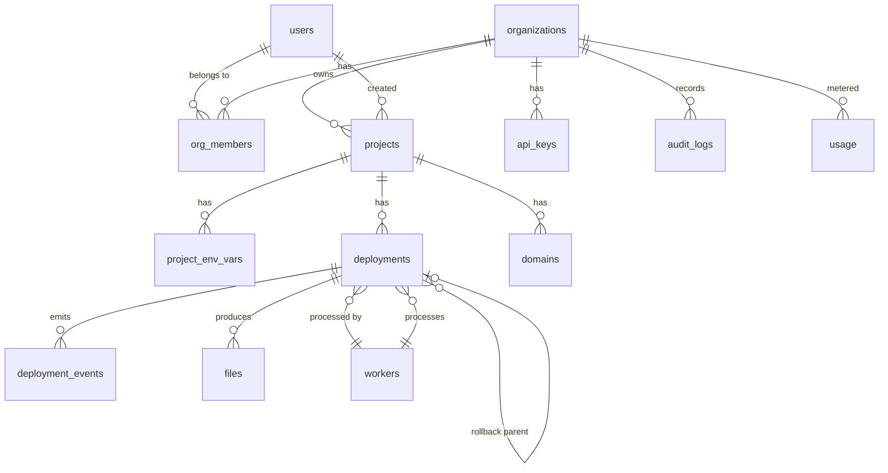

# ForgeCloud — Data Model

PostgreSQL is the source of truth. Below is the initial schema: the entity map, the tables (as reference DDL), and notes. Treat the DDL as a starting blueprint — turn each block into a `node-pg-migrate` migration and regenerate Kysely types. Sessions, rate-limit counters, locks and queue state live in **Redis**, not here.

Conventions: `uuid` PKs via `gen_random_uuid()` (needs `pgcrypto`), `timestamptz` timestamps, `snake_case`, durations in ms, sizes in bytes.

---

## 1. Entity map



---

## 2. Extensions & enums

```sql
CREATE EXTENSION IF NOT EXISTS pgcrypto;

CREATE TYPE org_role AS ENUM ('owner', 'admin', 'member', 'viewer');

CREATE TYPE deployment_status AS ENUM (
  'queued', 'assigned', 'cloning', 'installing', 'building',
  'creating_container', 'starting', 'health_check', 'live',
  'failed', 'stopped', 'rolled_back', 'canceled'
);

CREATE TYPE worker_status AS ENUM ('idle', 'busy', 'offline', 'draining');

CREATE TYPE file_kind AS ENUM ('source', 'artifact', 'log');

CREATE TYPE log_stream AS ENUM ('stdout', 'stderr', 'system');
```

> Keep the same status/role strings in `@forge/shared`. The enum is defined once in TS and mirrored here.

---

## 3. Tables

### users
```sql
CREATE TABLE users (
  id             uuid PRIMARY KEY DEFAULT gen_random_uuid(),
  email          citext UNIQUE NOT NULL,          -- requires citext ext, or text + lower() unique index
  name           text NOT NULL,
  password_hash  text NOT NULL,                   -- argon2
  email_verified_at timestamptz,
  created_at     timestamptz NOT NULL DEFAULT now(),
  updated_at     timestamptz NOT NULL DEFAULT now()
);
```

### organizations
```sql
CREATE TABLE organizations (
  id          uuid PRIMARY KEY DEFAULT gen_random_uuid(),
  name        text NOT NULL,
  slug        text UNIQUE NOT NULL,
  created_by  uuid NOT NULL REFERENCES users(id),
  created_at  timestamptz NOT NULL DEFAULT now(),
  updated_at  timestamptz NOT NULL DEFAULT now()
);
```

### org_members  (RBAC join)
```sql
CREATE TABLE org_members (
  org_id     uuid NOT NULL REFERENCES organizations(id) ON DELETE CASCADE,
  user_id    uuid NOT NULL REFERENCES users(id) ON DELETE CASCADE,
  role       org_role NOT NULL DEFAULT 'member',
  created_at timestamptz NOT NULL DEFAULT now(),
  PRIMARY KEY (org_id, user_id)
);
```

### projects
```sql
CREATE TABLE projects (
  id               uuid PRIMARY KEY DEFAULT gen_random_uuid(),
  org_id           uuid NOT NULL REFERENCES organizations(id) ON DELETE CASCADE,
  name             text NOT NULL,
  slug             text NOT NULL,
  source_type      text NOT NULL DEFAULT 'upload',   -- 'upload' | 'git'
  repo_url         text,
  root_dir         text NOT NULL DEFAULT '.',
  install_command  text NOT NULL DEFAULT 'npm install',
  build_command    text NOT NULL DEFAULT 'npm run build',
  start_command    text NOT NULL DEFAULT 'npm start',
  app_port         int  NOT NULL DEFAULT 3000,       -- port the app listens on inside the container
  health_path      text NOT NULL DEFAULT '/',
  health_timeout_ms int NOT NULL DEFAULT 30000,
  active_deployment_id uuid,                          -- FK added after deployments (circular)
  created_by       uuid NOT NULL REFERENCES users(id),
  created_at       timestamptz NOT NULL DEFAULT now(),
  updated_at       timestamptz NOT NULL DEFAULT now(),
  UNIQUE (org_id, slug)
);
```

### project_env_vars
```sql
CREATE TABLE project_env_vars (
  id          uuid PRIMARY KEY DEFAULT gen_random_uuid(),
  project_id  uuid NOT NULL REFERENCES projects(id) ON DELETE CASCADE,
  key         text NOT NULL,
  value_enc   bytea NOT NULL,        -- encrypted at rest
  is_secret   boolean NOT NULL DEFAULT true,
  created_at  timestamptz NOT NULL DEFAULT now(),
  updated_at  timestamptz NOT NULL DEFAULT now(),
  UNIQUE (project_id, key)
);
```

### deployments
```sql
CREATE TABLE deployments (
  id                 uuid PRIMARY KEY DEFAULT gen_random_uuid(),
  project_id         uuid NOT NULL REFERENCES projects(id) ON DELETE CASCADE,
  org_id             uuid NOT NULL REFERENCES organizations(id) ON DELETE CASCADE,
  status             deployment_status NOT NULL DEFAULT 'queued',
  source_ref         text,                 -- commit sha (git) / source file id (upload)
  source_file_id     uuid REFERENCES files(id) ON DELETE SET NULL,  -- the stored object built from
  idempotency_key    text,
  attempt            int NOT NULL DEFAULT 0,
  triggered_by       uuid REFERENCES users(id) ON DELETE SET NULL,
  worker_id          uuid REFERENCES workers(id) ON DELETE SET NULL,
  parent_deployment_id uuid REFERENCES deployments(id) ON DELETE SET NULL,  -- rollback lineage
  image_tag          text,
  container_id       text,
  url                text,                 -- local url when live, e.g. http://localhost:PORT
  host_port          int CHECK (host_port IS NULL OR host_port BETWEEN 1 AND 65535),
  fail_at            deployment_status,    -- demo hook: simulated pipeline fails here
  error_code         text,
  error_message      text,
  queued_at          timestamptz NOT NULL DEFAULT now(),
  started_at         timestamptz,
  finished_at        timestamptz,
  duration_ms        int,
  created_at         timestamptz NOT NULL DEFAULT now(),
  updated_at         timestamptz NOT NULL DEFAULT now()
);

-- Idempotency. A plain UNIQUE (project_id, source_ref, idempotency_key) would
-- never fire: in Postgres two NULLs don't collide, so keyless deploys (the
-- common case) and keyed-but-refless ones both slip through. A partial unique
-- index over coalesce(source_ref,'') enforces it exactly when a key was sent,
-- and leaves keyless deploys free to repeat.
CREATE UNIQUE INDEX uq_deployments_idempotency
  ON deployments (project_id, coalesce(source_ref, ''), idempotency_key)
  WHERE idempotency_key IS NOT NULL;

CREATE INDEX idx_deployments_project ON deployments (project_id, created_at DESC);
CREATE INDEX idx_deployments_status  ON deployments (status);

-- deferred circular FKs (added with the deployments migration)
ALTER TABLE projects
  ADD CONSTRAINT projects_active_deployment_fkey
  FOREIGN KEY (active_deployment_id) REFERENCES deployments(id) ON DELETE SET NULL;
ALTER TABLE files
  ADD CONSTRAINT files_deployment_fkey
  FOREIGN KEY (deployment_id) REFERENCES deployments(id) ON DELETE CASCADE;
```

### deployment_events  (append-only log of transitions + log lines)
```sql
CREATE TABLE deployment_events (
  id             bigint GENERATED ALWAYS AS IDENTITY PRIMARY KEY,  -- ordering
  deployment_id  uuid NOT NULL REFERENCES deployments(id) ON DELETE CASCADE,
  type           text NOT NULL CHECK (type IN ('status', 'log')),
  status         deployment_status,          -- set when type='status'
  stream         log_stream,                 -- set when type='log'
  message        text,
  created_at     timestamptz NOT NULL DEFAULT now(),
  -- A status event carries a status; a log event carries a stream.
  CHECK ((type = 'status' AND status IS NOT NULL) OR (type = 'log' AND stream IS NOT NULL))
);

CREATE INDEX idx_dep_events_deployment ON deployment_events (deployment_id, id);
```
> Full logs are also persisted as a file in local storage (`files` with `kind='log'`). This table keeps the ordered timeline / recent tail for quick queries and reconnect replay.

### workers
```sql
CREATE TABLE workers (
  id                 uuid PRIMARY KEY DEFAULT gen_random_uuid(),
  name               text NOT NULL,
  status             worker_status NOT NULL DEFAULT 'idle',
  host               text,
  pid                int,
  current_deployment_id uuid REFERENCES deployments(id) ON DELETE SET NULL,
  concurrency        int NOT NULL DEFAULT 1,
  last_heartbeat_at  timestamptz,
  created_at         timestamptz NOT NULL DEFAULT now()
);
```
> Live heartbeats also go to Redis with a TTL (`worker:<id>:heartbeat`, plus the
> `workers:online` set); this table is the registry/history. Liveness is read from
> Redis, not from `status`: a worker killed with SIGKILL never gets to write
> `offline`, but its heartbeat key still expires.

### api_keys
```sql
CREATE TABLE api_keys (
  id           uuid PRIMARY KEY DEFAULT gen_random_uuid(),
  org_id       uuid NOT NULL REFERENCES organizations(id) ON DELETE CASCADE,
  name         text NOT NULL,
  prefix       text NOT NULL,          -- shown in UI, e.g. 'fc_live_ab12'
  key_hash     text NOT NULL,          -- hash of the full key; full key shown once
  scopes       text[] NOT NULL DEFAULT '{}',
  last_used_at timestamptz,
  created_by   uuid NOT NULL REFERENCES users(id),
  revoked_at   timestamptz,
  created_at   timestamptz NOT NULL DEFAULT now()
);
CREATE INDEX idx_api_keys_prefix ON api_keys (prefix);
```

### domains
```sql
CREATE TABLE domains (
  id          uuid PRIMARY KEY DEFAULT gen_random_uuid(),
  project_id  uuid NOT NULL REFERENCES projects(id) ON DELETE CASCADE,
  hostname    text UNIQUE NOT NULL,     -- e.g. myapp.localhost
  verified    boolean NOT NULL DEFAULT false,
  created_at  timestamptz NOT NULL DEFAULT now()
);
```

### files  (local object-storage index)
```sql
CREATE TABLE files (
  id            uuid PRIMARY KEY DEFAULT gen_random_uuid(),
  deployment_id uuid REFERENCES deployments(id) ON DELETE CASCADE,
  project_id    uuid REFERENCES projects(id) ON DELETE CASCADE,
  kind          file_kind NOT NULL,
  storage_path  text NOT NULL,         -- path inside the local object store
  size_bytes    bigint NOT NULL DEFAULT 0,
  checksum      text,                  -- sha256 of the bytes as stored
  content_type  text,
  original_name text,                  -- client filename, display only
  -- Compression metadata (Phase 3). NULL compression = stored as-is; 'gzip'
  -- means size_bytes/checksum describe the compressed bytes and the
  -- uncompressed_* columns describe the original.
  parent_file_id        uuid REFERENCES files(id) ON DELETE SET NULL,
  compression           text,          -- NULL | 'gzip'
  uncompressed_bytes    bigint,
  uncompressed_checksum text,
  created_at    timestamptz NOT NULL DEFAULT now()
);
CREATE INDEX idx_files_deployment ON files (deployment_id);
CREATE INDEX idx_files_parent ON files (parent_file_id);
```

### usage  (metering)
```sql
CREATE TABLE usage (
  id            uuid PRIMARY KEY DEFAULT gen_random_uuid(),
  org_id        uuid NOT NULL REFERENCES organizations(id) ON DELETE CASCADE,
  metric        text NOT NULL,          -- 'build_minutes' | 'deployments' | 'bytes_stored' ...
  value         numeric NOT NULL DEFAULT 0,
  period_start  timestamptz NOT NULL,
  period_end    timestamptz NOT NULL,
  created_at    timestamptz NOT NULL DEFAULT now()
);
CREATE INDEX idx_usage_org_period ON usage (org_id, period_start);
```

### audit_logs
```sql
CREATE TABLE audit_logs (
  id           uuid PRIMARY KEY DEFAULT gen_random_uuid(),
  org_id       uuid REFERENCES organizations(id) ON DELETE CASCADE,
  actor_user_id uuid REFERENCES users(id),
  action       text NOT NULL,           -- 'project.create', 'deployment.rollback' ...
  target_type  text,
  target_id    text,
  metadata     jsonb NOT NULL DEFAULT '{}',
  ip           inet,
  created_at   timestamptz NOT NULL DEFAULT now()
);
CREATE INDEX idx_audit_org ON audit_logs (org_id, created_at DESC);
```

---

## 4. Lives in Redis, not Postgres

| Concern | Redis shape |
|---|---|
| Sessions | `session:<token>` → user/org, TTL |
| Rate limits | `rl:<scope>:<id>` counters, TTL |
| Distributed locks | `lock:project:<id>` (one live/starting container per project) |
| Queue | BullMQ keys under `bull:deployments:*` |
| Pub/Sub | channels `deployment:<id>`, `project:<id>`, `metrics` |
| Worker heartbeats | `worker:<id>:heartbeat` TTL |
| Log tail cache | `deployment:<id>:logtail` (bounded list) |

---

## 5. Notes & decisions to confirm

- **Encryption of env vars**: symmetric (AES-256-GCM) with a key from env/KMS-stub. Confirm whether that's enough for the project's scope or if you want per-org keys.
- **`citext`** used for case-insensitive email; if you'd rather not add the extension, use `text` + a `UNIQUE` index on `lower(email)`.
- **Logs storage**: dual-write (file + `deployment_events`) is deliberate — files for full history/download, table for ordered replay on WS reconnect. Drop one if it's overkill for the demo.
- **Multi-tenancy**: everything is scoped by `org_id`; every query in a repository must filter by the caller's org. Consider Postgres Row-Level Security later if you want to demo defense-in-depth.
